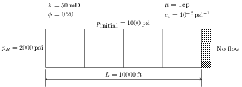

# Assignment 10 — A one-dimensional reservoir simulator

[](https://github.com/PGE323M/assignment10/actions)

## Engineering task

Implement `OneDimReservoir.fill_matrices()` and `OneDimReservoir.solve_one_step()`
in `assignment10.py`. The supplied methods read a dictionary or `inputs.yml`,
compute coefficients, apply boundary conditions and initial pressure, repeat time
steps, and plot saved pressures. Keep those methods and their interfaces intact.
Use NumPy and SciPy sparse matrices; do not replace the implicit solve with a dense
solver or a high-level simulator. Support at least two grid blocks.



The example reservoir is 10,000 ft long with permeability 50 mD, porosity 0.2,
water viscosity 1 cP, compressibility 10^-6 psi^-1, and initial pressure 1000 psi.
The left face is held at 2000 psi and the right face is closed (zero flux).
`inputs.yml` contains these values, four equal blocks, a one-day time step and
three time steps. Pressure unknowns lie at block centers, not at the boundary faces.

For uniform blocks, define

\[
\Delta x=L/N_x,\quad
\alpha=\frac{k}{\mu\phi c_t},\quad
\eta=0.00633\,\alpha\frac{\Delta t}{\Delta x^2}.
\]

The conversion factor applies to mD, cP, psi, feet and days; `eta` is dimensionless.
For an interior row, the dimensionless matrix `A` has diagonal 2 and neighboring
entries -1. At a boundary, the remaining neighboring entry is -1. A closed face
has diagonal 1 and zero boundary contribution. A prescribed-pressure face has
diagonal 3 and boundary contribution `2 * eta * boundary_pressure`. This factor
of two accounts for the half-block distance to the face. The supplied boundary
helper supports prescribed pressure and zero prescribed flux on either face;
nonzero flux is outside this exercise because cross-sectional area is not specified.

### `fill_matrices()`

Create sparse `A` and identity `I`, both shape `(Nx, Nx)`, and a NumPy vector
`pB` of shape `(Nx,)`. Assemble the neighbor stencil, call the supplied
`apply_boundary_conditions(A, pB)`, and store `self.A`, `self.I`, and `self.pB`.
Store `A` in CSR format. Do not multiply `A` by `eta` during assembly;
`pB` already contains its `eta` factor.

### `solve_one_step()`

Use the pressure at the start of the step on every right-hand-side term:

\[
\text{explicit: }p^{n+1}=(I-\eta A)p^n+p_B,
\]
\[
\text{implicit: }(I+\eta A)p^{n+1}=p^n+p_B.
\]

For implicit stepping, use `scipy.sparse.linalg.cg` with `atol=1e-8` and
`rtol=0.0`. Check its returned status; raise an error rather than accepting a
failed solve. Store the new vector in `self.p`. Reject unknown solver names.
`solve()` performs the requested number of additional steps.

## Plan, implement, then validate

Before permitting an agent to edit, ask it to read the specification, supplied
methods, inputs and public tests and propose a short plan identifying:

1. Which files define the equations, input values, interfaces and test expectations.
2. Units and shapes of `A`, `I`, `p`, `pB` and `eta`.
3. How each boundary changes the matrix and right-hand side.
4. The smallest implementation step and independent numerical checks.

Review and approve the plan, then inspect the diff before accepting the changes.
Do not ask the agent to edit protected tests or input files to make them pass.
The submission skill/script is supplied; no new skill or instruction repair is
required. Only `assignment10.py` is a deliverable. Planning and the checks below
are formative; no chat transcript or additional evidence file is submitted.

After testing, use a temporary Python session and copied input dictionaries to:

- Display `eta`, `A.toarray()` and `pB`; explain their units and boundary rows.
- Verify that uniform pressure with two closed faces remains unchanged.
- Compare a step against the stated equation, and check the implicit residual.
- Compare explicit and implicit results at the same final time as the time step
  decreases. Explain why stability does not establish accuracy.

For this mixed-boundary stencil, `eta <= 1/3` is a sufficient condition for
nonnegative explicit update weights (the boundary diagonal is 3). The example
has `eta = 0.2532`. Larger values can produce oscillations or overshoot; implicit
stepping does not have this explicit restriction, but still has time-discretization
error. Do not assume changing grid count while keeping the time step preserves
explicit stability: `eta` scales with `1 / delta_x**2`.

## Run and explore

```bash
python -m unittest -v test.py test_submission.py
```

Public tests check the simulator and guarded submission workflow. Passing them
is necessary but does not replace the independent checks above.

```python
from assignment10 import OneDimReservoir
import matplotlib.pyplot as plt

problem = OneDimReservoir('inputs.yml')
problem.solve()
print(problem.get_solution())
problem.plot()
plt.xlabel('Grid block index')
plt.ylabel('Pressure (psi)')
plt.show()
```

For experiments, copy the inputs in memory; do not change the protected YAML.
Plot snapshots are copies, so later steps do not change earlier saved values.
A notebook is optional for your own exploration; the submitted implementation
must remain in `assignment10.py`.

## Submit

Ask the agent to `submit assignment 10`. It loads the supplied submission skill,
checks the protected policy, runs tests and previews the exact commit/push steps.
Review the dry run and explicitly approve execution. It stages only
`assignment10.py`, stops on unexpected changes or failed checks, and reports the
commit and GitHub Actions result separately. Pending checks are not a pass.
